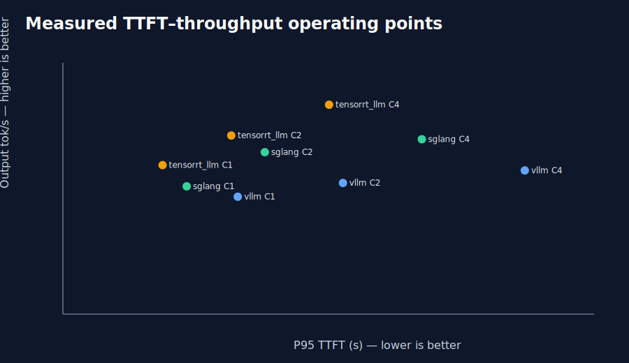

# Long-Context LLM Inference Engine Benchmark

[](https://github.com/ramsred/llm-engine-benchmark/actions/workflows/ci.yml)

A reproducible, neutral benchmark for choosing a long-context serving stack on NVIDIA GB10. It compares vLLM, SGLang, and direct TensorRT-LLM serving with the same prompts, client-side metric formulas, cache protocols, and concurrency matrix.



> The checked-in cross-engine values are preliminary one-repetition evidence. They are useful for portfolio review and experiment planning, but are not a final universal ranking. Run the three-repetition matrix before making production decisions.

## What this project demonstrates

- Engine-neutral long-context workload construction and exact token-count validation.
- Cold unique-prefix versus warm shared-prefix cache experiments.
- TTFT, TPOT, ITL, E2E latency, request/output throughput, cache evidence, and host telemetry.
- Sequential Docker orchestration with pinned model, tokenizer, dataset, and image evidence.
- Decision-oriented reporting that separates observations from hypotheses and profiler-backed conclusions.

## Preliminary headline findings

For the supplied warm shared-prefix comparison at C1/C2/C4, TensorRT-LLM has the lowest reported TTFT and E2E latency and the highest reported request throughput. The supplied data uses one repetition per configuration; the cold C4 TensorRT-LLM ITL P95 anomaly is retained as a profiling target rather than explained causally.

See [results analysis](docs/results.md), [limitations](docs/fairness-and-limitations.md), and the compact [summary artifacts](results/README.md) for the evidence status and units.

## Benchmark contract

| Dimension | Default control |
| --- | --- |
| Model | `openai/gpt-oss-20b` |
| Hardware target | One NVIDIA GB10 / DGX Spark system |
| Prompt / output | Exactly 120,000 input tokens / 512 generated tokens |
| Samples | 100 canonical records |
| Modes | `cold`, `warm_shared` |
| Concurrency | 1, 2, 4 |
| Repetitions | 3 for the final matrix |
| Memory target | 0.80 engine-specific fraction |
| Client | One neutral OpenAI-compatible streaming client |

Scheduler, batching, kernel, cache-block, and memory-allocation semantics differ across runtimes. The controls are matched by intent and documented as such; they are not claimed to be mechanically identical.

## Quick start

Install the project and developer tools:

```bash
python3 -m pip install -e ".[dev]"
```

Run a GPU/Docker smoke test across all three engines:

```bash
./scripts/smoke_test.sh --overwrite --cooldown-seconds 5
```

Run the full three-engine matrix:

```bash
./bench run --engines all --modes cold,warm_shared \
  --concurrency 1,2,4 --repetitions 3
```

The smoke and full commands perform real inference and require Docker, NVIDIA Container Toolkit, model/data access, and sufficient disk. Ordinary CI runs tests, dry-run orchestration, package checks, and manifest verification only; it does not run GPU inference.

## Reports, charts, and provenance

Generate accepted-run tables from the reporting pipeline:

```bash
./bench report
python3 scripts/generate_charts.py --input results/report/summary.csv
```

The report writes an autogenerated marker and `results/report/provenance.json` containing the benchmark commit, experiment-lock hash, accepted runs, and accepted repetitions. The supplied portfolio charts are stored under `assets/charts/` with their compact source CSVs and preliminary-results labeling. The chart generator remains available for regenerating SVG decision views from accepted report summaries.

Do not hand-edit public numeric tables. The intended evidence flow is:

```text
accepted run JSON + request timings
        -> ./bench report
        -> summary CSV + provenance
        -> scripts/generate_charts.py
        -> charts and portfolio report
```

## Documentation

- [Methodology and fairness contract](docs/methodology.md)
- [Architecture](docs/architecture.md)
- [Results and analysis](docs/results.md)
- [Profiling plan](docs/profiling.md)
- [Fairness and limitations](docs/fairness-and-limitations.md)
- [Production recommendations](docs/production-recommendations.md)
- [Reproducibility and implementation details](docs/reproducibility.md)
- [Result schema](docs/RESULT_SCHEMA.md)
- [Design-to-implementation mapping](docs/DESIGN_MAPPING.md)

TensorRT-LLM uses the direct `trtllm-serve` backend with the same prepared prompts and neutral client. Triton integration is intentionally deferred and documented as planned work; it is not represented as a completed experiment.

## CI and development

GitHub Actions runs on Python 3.10, 3.11, and 3.12. It installs `.[dev]`, runs pytest, validates the CLI and three-engine dry-run plan, and verifies `PROJECT_MANIFEST.sha256`. See [.github/workflows/ci.yml](.github/workflows/ci.yml).

The repository excludes model weights, Hugging Face caches, TensorRT engines, server logs, raw telemetry, and request JSONL from version control. Large evidence bundles belong in GitHub Releases with their lock file, image digests, environment manifest, and benchmark commit.

## Roadmap

- [x] vLLM integration
- [x] SGLang integration
- [x] TensorRT-LLM direct integration
- [x] 120K cold and warm shared-prefix workloads
- [x] Cache evidence and result provenance
- [x] CI and packaging validation
- [ ] Three repetitions per matrix cell
- [ ] Nsight Systems profiling
- [ ] TensorRT-LLM through Triton
- [ ] Context scaling: 8K, 32K, 64K, 120K
- [ ] SLA-constrained throughput

## Authorship and citation

Maintainer: Venkata Rami Reddy Kallu. See [CITATION.cff](CITATION.cff) for citation metadata. The project is licensed under MIT.
