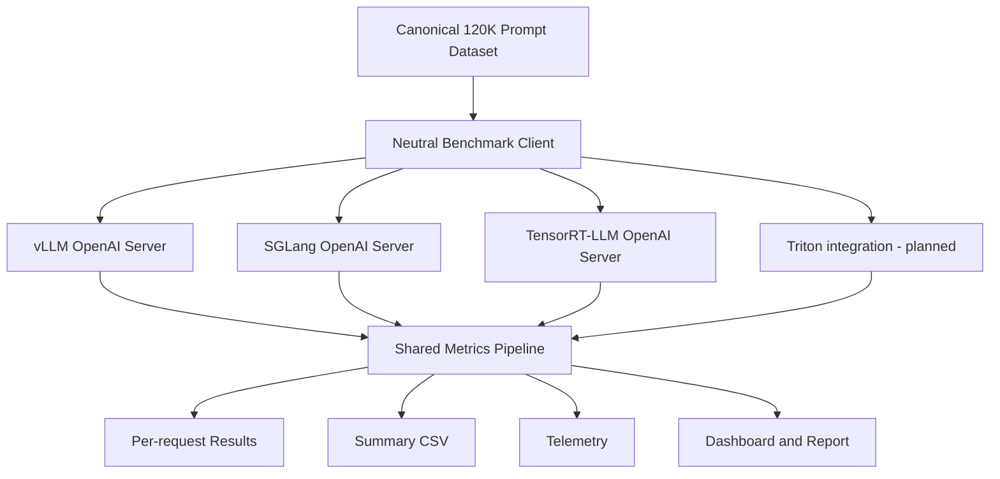

# Architecture

The benchmark separates workload construction, serving, measurement, and interpretation.

Each engine runs sequentially on the same NVIDIA GB10 host. The client owns request scheduling and metric formulas; engine-native benchmark CLIs are not used.
